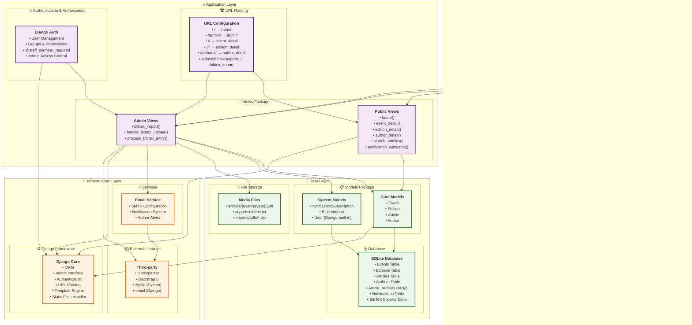

# Diagrama de Pacotes - Arquitetura do Sistema

Este diagrama mostra a organização arquitetural do sistema PaperPaper seguindo o padrão MVT (Model-View-Template) do Django.

## Descrição da Arquitetura

### 🌐 **Presentation Layer (Camada de Apresentação)**
- **Templates**: Interface do usuário usando Django Templates + Bootstrap
- **Static Files**: Recursos estáticos (CSS, JS, imagens)
- **Admin Interface**: Interface administrativa customizada do Django

### ⚡ **Application Layer (Camada de Aplicação)**
- **Views**: Lógica de negócio e controle de fluxo
- **URL Routing**: Mapeamento de URLs para views
- **Authentication**: Sistema de autenticação e autorização

### 💾 **Data Layer (Camada de Dados)**
- **Models**: Modelos de dados usando Django ORM
- **Database**: Banco de dados SQLite para persistência
- **File Storage**: Armazenamento de arquivos PDF e uploads

### 🔧 **Infrastructure Layer (Camada de Infraestrutura)**
- **Django Framework**: Framework web principal
- **External Libraries**: Bibliotecas de terceiros
- **Services**: Serviços externos (email, etc.)

## Principais Características

### 📊 **Separação de Responsabilidades**
- Cada camada tem responsabilidades bem definidas
- Baixo acoplamento entre componentes
- Alta coesão dentro de cada pacote

### 🔄 **Fluxo de Dados**
1. **Request** → URLs → Views
2. **Views** → Models → Database
3. **Views** → Templates → **Response**

### 🛡️ **Segurança**
- Autenticação baseada em sessões
- Autorização por grupos e permissões
- Proteção CSRF automática do Django

### 📈 **Escalabilidade**
- Arquitetura modular facilita expansão
- ORM permite migração para outros SGBDs
- Sistema de templates reutilizáveis