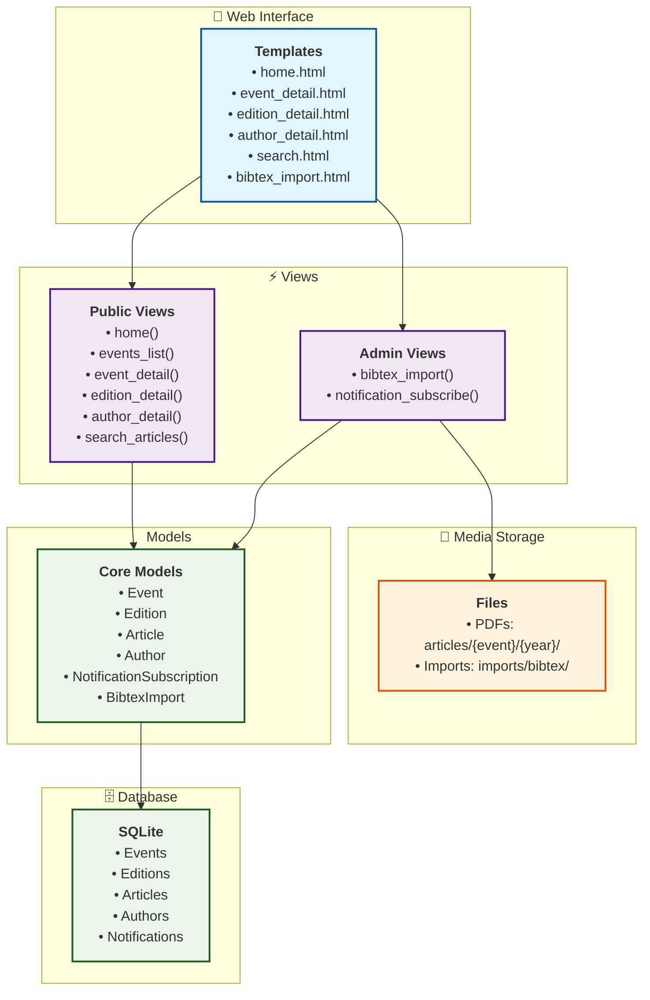

# Diagrama de Pacotes - Sistema PaperPaper

```mermaid
graph TB
    subgraph "📱 Web Interface"
        TEMPLATES["`**Templates**
        • home.html
        • event_detail.html
        • edition_detail.html
        • author_detail.html
        • search.html
        • bibtex_import.html`"]
    end

    subgraph "⚡ Views"
        PUBLIC_VIEWS["`**Public Views**
        • home()
        • events_list()
        • event_detail()
        • edition_detail()
        • author_detail()
        • search_articles()`"]
        
        ADMIN_VIEWS["`**Admin Views**
        • bibtex_import()
        • notification_subscribe()`"]
    end

    subgraph " Models"
        MODELS["`**Core Models**
        • Event
        • Edition
        • Article
        • Author
        • NotificationSubscription
        • BibtexImport`"]
    end

    subgraph "🗄️ Database"
        DATABASE["`**SQLite**
        • Events
        • Editions
        • Articles
        • Authors
        • Notifications`"]
    end

    subgraph "📁 Media Storage"
        MEDIA["`**Files**
        • PDFs: articles/{event}/{year}/
        • Imports: imports/bibtex/`"]
    end

    %% Relationships
    TEMPLATES --> PUBLIC_VIEWS
    TEMPLATES --> ADMIN_VIEWS
    PUBLIC_VIEWS --> MODELS
    ADMIN_VIEWS --> MODELS
    MODELS --> DATABASE
    ADMIN_VIEWS --> MEDIA

    %% Styling
    classDef presentation fill:#e1f5fe,stroke:#01579b,stroke-width:2px
    classDef application fill:#f3e5f5,stroke:#4a148c,stroke-width:2px
    classDef data fill:#e8f5e8,stroke:#1b5e20,stroke-width:2px
    classDef storage fill:#fff3e0,stroke:#e65100,stroke-width:2px
    
    class TEMPLATES presentation
    class PUBLIC_VIEWS,ADMIN_VIEWS application
    class MODELS,DATABASE data
    class MEDIA storage
```