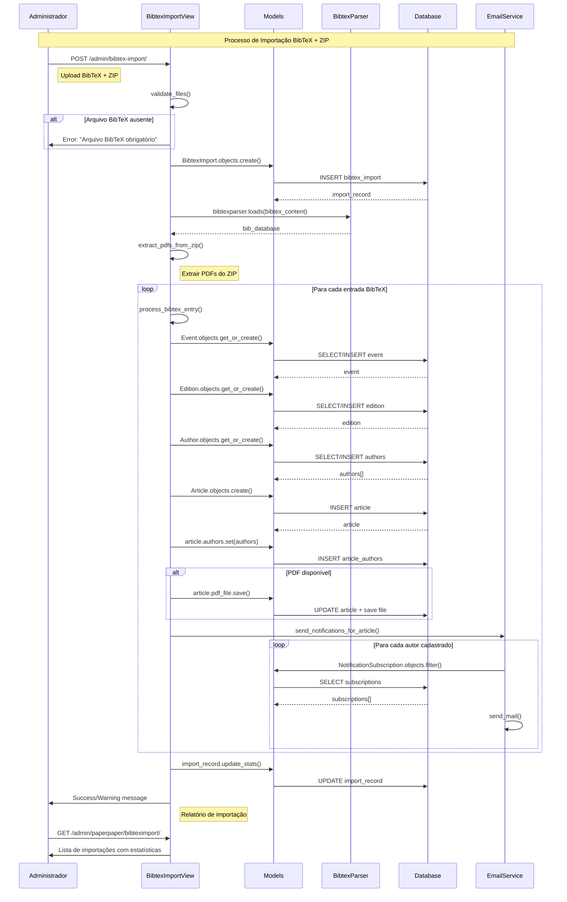

# Diagrama de Sequência - Importação BibTeX

Este diagrama mostra o fluxo de execução da importação de artigos via BibTeX, uma das funcionalidades mais importantes do sistema PaperPaper.

## Fluxo Detalhado

### 1. **Validação Inicial**
- Upload de arquivo BibTeX (obrigatório)
- Upload de ZIP com PDFs (opcional)
- Validação de tipos de arquivo

### 2. **Processamento BibTeX**
- Parse do arquivo BibTeX
- Extração de metadados (título, autor, evento, ano)
- Validação de campos obrigatórios

### 3. **Criação de Entidades**
- **Eventos**: Criados baseado no campo `booktitle`
- **Edições**: Associadas ao evento + ano
- **Autores**: Parseados do campo `author`
- **Artigos**: Criados com todos os metadados

### 4. **Processamento de Arquivos**
- Associação de PDFs baseada na chave BibTeX
- Upload para `media/articles/{evento}/{ano}/`

### 5. **Notificações**
- Envio automático para autores cadastrados
- Sistema de inscrições por email

### 6. **Relatório Final**
- Estatísticas de sucesso/falha
- Log detalhado de processamento
- Interface administrativa para acompanhamento